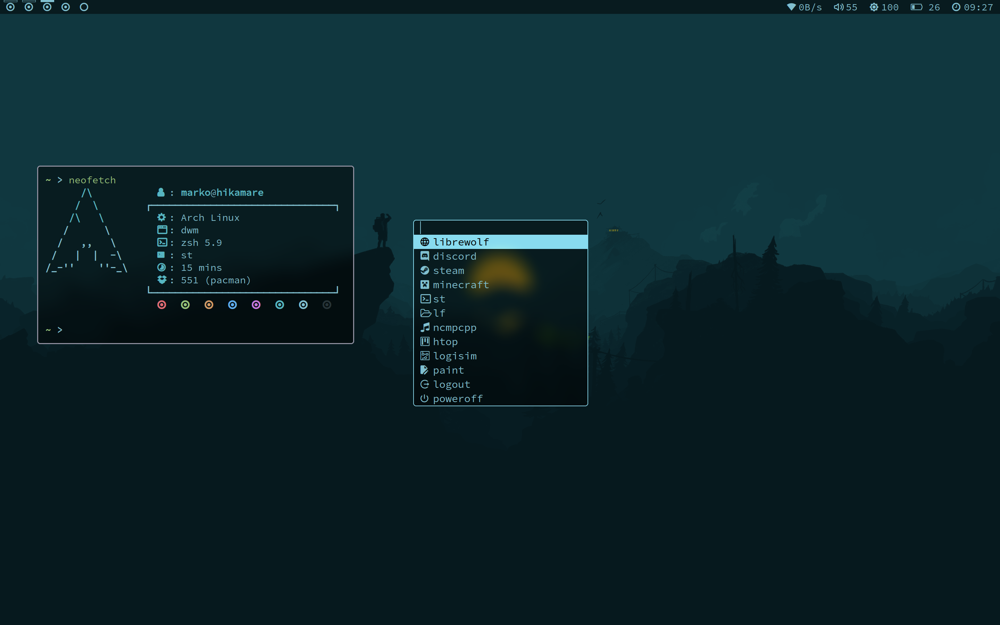

My suckless setup
============================

Installation
------------
To install on arch linux based distros you need to run the script

    ./install.sh

Running
-----------
Add the following lines to your .bashrc or .zshrc to automatically start dwm after login:

    export XINITRC=$HOME/.config/x/xinitrc
    [[ -z $DISPLAY && $XDG_VTNR -eq 1 ]] && exec startx $XINITRC
